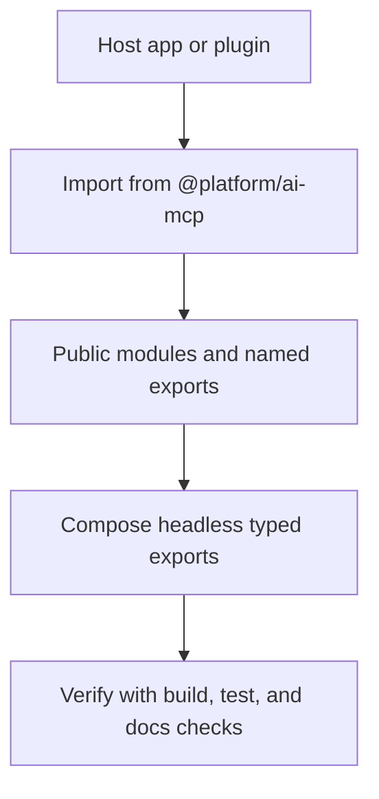

# AI MCP Developer Guide

MCP descriptors and connectors derived from framework actions, resources, and prompts.

**Maturity Tier:** `Hardened`

## Purpose And Architecture Role

Provides MCP-oriented helper contracts so the rest of the stack can compose AI tools and transports through typed abstractions.

### This library is the right fit when

- You need **MCP helpers**, **tool contracts**, **transport composition** as a reusable, package-level boundary.
- You want to consume typed exports from `@platform/ai-mcp` instead of reaching into app-specific internals.
- You want documentation, verification, and package boundaries to stay aligned in the extracted-repo model.

### This library is intentionally not

- Not an end-user AI product or provider control plane on its own.
- Not a substitute for surrounding approval, audit, and budget governance.

## Repo Map

| Path | Purpose |
| --- | --- |
| `package.json` | Root extracted-repo manifest, workspace wiring, and repo-level script entrypoints. |
| `framework/libraries/ai-mcp` | Nested publishable library package. |
| `framework/libraries/ai-mcp/src` | Public runtime source and exported modules. |
| `framework/libraries/ai-mcp/tests` | Unit and contract verification where present. |

## Package Contract

| Field | Value |
| --- | --- |
| Package ID | `ai-mcp` |
| Display Name | AI MCP |
| Import Name | `@platform/ai-mcp` |
| Version | `0.1.0` |
| UI Surface | Headless typed exports |
| Consumption Model | Imports + typed helpers |

## Dependency Graph And Compatibility

| Field | Value |
| --- | --- |
| Direct Dependencies | `@platform/ai`, `@platform/schema` |
| Peer Dependencies | None |
| Dev Dependencies | None |
| React Runtime | No |
| Workspace Scoped | Yes |

### Dependency interpretation

- Direct dependencies describe what the library needs at runtime to satisfy its public exports.
- Workspace-scoped dependencies mean extracted repos should be consumed through a compatible Gutu workspace or vendor-synced environment.
- Peer dependencies should be satisfied by the host when the library is integrated outside the certification workspace.

## Public API Surface

| Module | File | Named Exports |
| --- | --- | --- |
| - | - | - |

### Source module map

| Source File | Exported Symbols |
| --- | --- |
| `index.ts` | `packageId`, `packageDisplayName`, `packageDescription`, `defineMcpServer`, `defineMcpClientConnector`, `deriveMcpToolDescriptor`, `deriveMcpResourceDescriptor`, `createMcpServerFromContracts` |

## React, UI, And Extensibility Notes

- UI surface: **Headless typed exports**
- Consumption model: **Imports + typed helpers**
- Extensibility points: explicit imports, props, callbacks, registries, providers, and typed helper APIs.
- This repo must **not** be documented as exposing a generic WordPress-style hook bus unless such a hook surface is explicitly exported through the public entrypoint.

## Failure Modes And Recovery

- Version drift between extracted repos can surface as missing `workspace:*` dependency resolution. Use a compatible Gutu workspace or vendor lock when integrating.
- Hosts should import from `@platform/ai-mcp`, not deep internal file paths, so refactors inside `src/` do not become accidental breaking changes.
- React-facing hosts should mount providers, registries, and callback surfaces exactly as documented by the public exports instead of depending on internal implementation details.
- When a host needs orchestration, keep it in the surrounding application or plugin runtime; this library does not promise hidden side effects outside what its public API exports.

## Mermaid Flows

### Primary Consumption Flow



## Integration Recipes

### 1. Package identity

```ts
import { packageId, packageDisplayName, defineMcpServer } from "@platform/ai-mcp";

console.log(packageId, packageDisplayName);
console.log(typeof defineMcpServer);
```

### 2. Safe consumption pattern

- Import from the package entrypoint, not `src/` internals.
- Compose through documented modules such as the exported entrypoint constants.
- Let host applications own orchestration, persistence, and cross-package business logic unless this library explicitly exports those concerns.

### 3. Cross-package composition

- Pair this library with sibling packages through typed imports and documented contracts, not hidden globals.
- If a plugin or app depends on this library, keep compatibility pinned through the workspace lock/vendor flow.
- Treat this library as a reusable foundation layer, not as a substitute for domain ownership.

## Test Matrix

| Lane | Present | Evidence |
| --- | --- | --- |
| Build | Yes | `bun run build` |
| Typecheck | Yes | `bun run typecheck` |
| Lint | Yes | `bun run lint` |
| Test | Yes | `bun run test` |
| Unit | Yes | 2 file(s) |
| Contracts | No | No contract files found |
| Integration | No | No integration files found |
| Migrations | No | No migration files found |

### Verification commands

- `bun run build`
- `bun run typecheck`
- `bun run lint`
- `bun run test`
- `bun run docs:check`
- `bun run test:unit`

## Current Truth And Recommended Next

### Current truth

- Publishes 0 public modules from `@platform/ai-mcp`.
- Exports 20 named symbols through the public entrypoint, including `packageId`, `packageDisplayName`, `packageDescription`, `defineMcpServer`, `defineMcpClientConnector`, `deriveMcpToolDescriptor`, and more.
- Keeps the public surface headless and import-driven rather than requiring a UI runtime.
- Verification lanes present: Build+Typecheck+Lint+Test.

### Current gaps

- Broad public API surface still relies on unit coverage only; there is no separate contract lane yet.
- Standalone consumers still need a compatible Gutu workspace to resolve workspace-scoped dependencies honestly.

### Recommended next

- Promote heavily reused inference and evaluation seams into clearer contract tests.
- Expand cookbook-style integration guidance only where the exported surface is already stable.
- Add contract-focused tests around the most reused public modules and exported helpers.
- Keep compatibility examples current as more extracted repos consume this library through the workspace vendor model.

### Later / optional

- Provider-specific optimization guides and richer benchmark packs after the baseline contracts harden.
