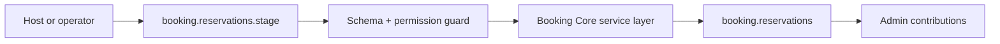

# Booking Core Developer Guide

Reservations, booking holds, and conflict-safe resource allocation flows.

**Maturity Tier:** `Hardened`

## Purpose And Architecture Role

Implements the reservation engine for staging, confirming, and cancelling allocation windows with conflict-safe database constraints.

### This plugin is the right fit when

- You need **reservation staging**, **hold confirmation**, **slot conflict safety** as a governed domain boundary.
- You want to integrate through declared actions, resources, jobs, workflows, and UI surfaces instead of implicit side effects.
- You need the host application to keep plugin boundaries honest through manifest capabilities, permissions, and verification lanes.

### This plugin is intentionally not

- Not a full vertical application suite; this plugin only owns the domain slice exported in this repo.
- Not a replacement for explicit orchestration in jobs/workflows when multi-step automation is required.
- Does not currently export recurring booking, waitlist, or availability-search APIs.
- Does not replace downstream orchestration for approvals or billing around a reservation lifecycle.

## Repo Map

| Path | Purpose |
| --- | --- |
| `package.json` | Root extracted-repo manifest, workspace wiring, and repo-level script entrypoints. |
| `framework/builtin-plugins/booking-core` | Nested publishable plugin package. |
| `framework/builtin-plugins/booking-core/src` | Runtime source, actions, resources, services, and UI exports. |
| `framework/builtin-plugins/booking-core/tests` | Unit, contract, integration, and migration coverage where present. |
| `framework/builtin-plugins/booking-core/docs` | Internal domain-doc source set kept in sync with this guide. |
| `framework/builtin-plugins/booking-core/db/schema.ts` | Database schema contract when durable state is owned. |
| `framework/builtin-plugins/booking-core/src/postgres.ts` | SQL migration and rollback helpers when exported. |

## Manifest Contract

| Field | Value |
| --- | --- |
| Package Name | `@plugins/booking-core` |
| Manifest ID | `booking-core` |
| Display Name | Booking Core |
| Version | `0.1.0` |
| Kind | `app` |
| Trust Tier | `first-party` |
| Review Tier | `R1` |
| Isolation Profile | `same-process-trusted` |
| Framework Compatibility | ^0.1.0 |
| Runtime Compatibility | bun>=1.3.12 |
| Database Compatibility | postgres, sqlite |

## Dependency Graph And Capability Requests

| Field | Value |
| --- | --- |
| Depends On | `auth-core`, `org-tenant-core`, `role-policy-core`, `audit-core`, `portal-core` |
| Requested Capabilities | `ui.register.admin`, `api.rest.mount`, `data.write.booking` |
| Provides Capabilities | `booking.reservations` |
| Owns Data | `booking.reservations` |

### Dependency interpretation

- Direct plugin dependencies describe package-level coupling that must already be present in the host graph.
- Requested capabilities tell the host what platform services or sibling plugins this package expects to find.
- Provided capabilities and owned data tell integrators what this package is authoritative for.

## Public Integration Surfaces

| Type | ID / Symbol | Access / Mode | Notes |
| --- | --- | --- | --- |
| Action | `booking.reservations.stage` | Permission: `booking.reservations.stage` | Stage a booking reservation as a held or confirmed allocation window.<br>Purpose: Create the canonical reservation record before downstream notifications, approvals, or portal views.<br>Idempotent<br>Audited |
| Action | `booking.reservations.confirm` | Permission: `booking.reservations.confirm` | Confirm a held or draft reservation after review has completed.<br>Purpose: Finalize a reservation without leaving transient hold metadata behind.<br>Idempotent<br>Audited |
| Action | `booking.reservations.cancel` | Permission: `booking.reservations.cancel` | Cancel a staged or confirmed reservation and release the resource window.<br>Purpose: Free a previously allocated slot while leaving an auditable trail for operators and customers.<br>Idempotent<br>Audited |
| Resource | `booking.reservations` | Portal enabled | Canonical reservation records for rooms, desks, appointments, and other allocatable resources.<br>Purpose: Provide the single source of truth for booking windows, hold state, confirmation state, and operator context.<br>Admin auto-CRUD enabled<br>Fields: `id`, `searchable`, `sortable`, `label`, `description`, `tenantId`, `searchable`, `sortable`, `label`, `description`, `resourceClass`, `searchable`, `sortable`, `label`, `description`, `resourceId`, `searchable`, `sortable`, `label`, `description`, `slotStart`, `sortable`, `label`, `description`, `slotEnd`, `sortable`, `label`, `description`, `confirmationStatus`, `filter`, `label`, `description`, `holdExpiresAt`, `sortable`, `label`, `description`, `actorId`, `searchable`, `sortable`, `label`, `description`, `idempotencyKey`, `searchable`, `sortable`, `label`, `description`, `reason`, `searchable`, `label`, `description`, `createdAt`, `sortable`, `label`, `description`, `updatedAt`, `sortable`, `label`, `description` |


### UI Surface Summary

| Surface | Present | Notes |
| --- | --- | --- |
| UI Surface | Yes | A bounded UI surface export is present. |
| Admin Contributions | Yes | Additional admin workspace contributions are exported. |
| Zone/Canvas Extension | No | No dedicated zone extension export. |

## Hooks, Events, And Orchestration

This plugin should be integrated through **explicit commands/actions, resources, jobs, workflows, and the surrounding Gutu event runtime**. It must **not** be documented as a generic WordPress-style hook system unless such a hook API is explicitly exported.

- No standalone plugin-owned lifecycle event feed is exported today.
- No plugin-owned job catalog is exported today.
- No plugin-owned workflow catalog is exported today.
- Recommended composition pattern: invoke actions, read resources, then let the surrounding Gutu command/event/job runtime handle downstream automation.

## Storage, Schema, And Migration Notes

- Database compatibility: `postgres`, `sqlite`
- Schema file: `framework/builtin-plugins/booking-core/db/schema.ts`
- SQL helper file: `framework/builtin-plugins/booking-core/src/postgres.ts`
- Migration lane present: Yes

The plugin ships explicit SQL helper exports. Use those helpers as the truth source for database migration or rollback expectations.

## Failure Modes And Recovery

- Action inputs can fail schema validation or permission evaluation before any durable mutation happens.
- If downstream automation is needed, the host must add it explicitly instead of assuming this plugin emits jobs.
- There is no separate lifecycle-event feed to rely on today; do not build one implicitly from internal details.
- Schema regressions are expected to show up in the migration lane and should block shipment.

## Mermaid Flows

### Primary Lifecycle




## Integration Recipes

### 1. Host wiring

```ts
import { manifest, stageReservationAction, BookingReservationResource, adminContributions, uiSurface } from "@plugins/booking-core";

export const pluginSurface = {
  manifest,
  stageReservationAction,
  BookingReservationResource,
  
  
  adminContributions,
  uiSurface
};
```

Use this pattern when your host needs to register the plugin’s declared exports without reaching into internal file paths.

### 2. Action-first orchestration

```ts
import { manifest, stageReservationAction } from "@plugins/booking-core";

console.log("plugin", manifest.id);
console.log("action", stageReservationAction.id);
```

- Prefer action IDs as the stable integration boundary.
- Respect the declared permission, idempotency, and audit metadata instead of bypassing the service layer.
- Treat resource IDs as the read-model boundary for downstream consumers.

### 3. Cross-plugin composition

- Compose this plugin through action invocations and resource reads.
- If downstream automation becomes necessary, add it in the surrounding Gutu command/event/job runtime instead of assuming this plugin already exports a hook surface.

## Test Matrix

| Lane | Present | Evidence |
| --- | --- | --- |
| Build | Yes | `bun run build` |
| Typecheck | Yes | `bun run typecheck` |
| Lint | Yes | `bun run lint` |
| Test | Yes | `bun run test` |
| Unit | Yes | 1 file(s) |
| Contracts | Yes | 1 file(s) |
| Integration | No | No integration files found |
| Migrations | Yes | 1 file(s) |

### Verification commands

- `bun run build`
- `bun run typecheck`
- `bun run lint`
- `bun run test`
- `bun run test:contracts`
- `bun run test:migrations`
- `bun run test:unit`
- `bun run docs:check`

## Current Truth And Recommended Next

### Current truth

- Exports 3 governed actions: `booking.reservations.stage`, `booking.reservations.confirm`, `booking.reservations.cancel`.
- Owns 1 resource contract: `booking.reservations`.
- Adds richer admin workspace contributions on top of the base UI surface.
- Ships explicit SQL migration or rollback helpers alongside the domain model.

### Current gaps

- No dedicated integration test lane is exported in this repo today; validation currently leans on build, lint, typecheck, and test lanes.
- No standalone plugin-owned event, job, or workflow catalog is exported yet; compose it through actions, resources, and the surrounding Gutu runtime.

### Recommended next

- Add richer availability search, recurrence, or waitlist flows only after the current reservation invariants stay stable.
- Introduce explicit downstream lifecycle events if other business systems must react automatically to booking transitions.
- Broaden lifecycle coverage with deeper orchestration, reconciliation, and operator tooling where the business flow requires it.
- Add more explicit domain events or follow-up job surfaces when downstream systems need tighter coupling.
- Add targeted integration coverage once the current lifecycle path is stable enough to benefit from end-to-end assertions.
- Promote important downstream reactions into explicit commands, jobs, or workflow steps instead of relying on implicit coupling.

### Later / optional

- Customer-facing booking journeys or pricing rules once the resource-allocation spine is fully settled.
- Outbound connectors, richer analytics, or portal-facing experiences once the core domain contracts harden.
