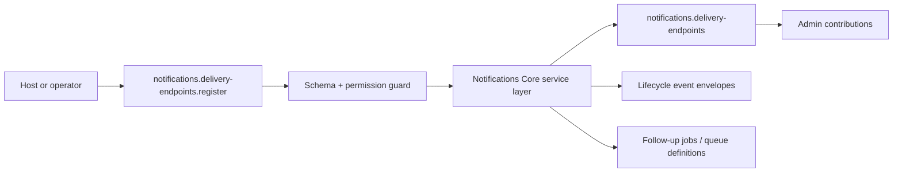

# Notifications Core Developer Guide

Canonical outbound communication control plane with delivery endpoints, preferences, attempts, and local provider routes.

**Maturity Tier:** `Production Candidate`

## Purpose And Architecture Role

Operates as the outbound communication control plane for deterministic local delivery, endpoint governance, preference management, and auditable attempt history.

### This plugin is the right fit when

- You need **message queueing**, **delivery attempts**, **endpoint and preference governance** as a governed domain boundary.
- You want to integrate through declared actions, resources, jobs, workflows, and UI surfaces instead of implicit side effects.
- You need the host application to keep plugin boundaries honest through manifest capabilities, permissions, and verification lanes.

### This plugin is intentionally not

- Not a full vertical application suite; this plugin only owns the domain slice exported in this repo.
- Not a replacement for explicit orchestration in jobs/workflows when multi-step automation is required.
- Does not currently ship live third-party connector packages in this repo.
- Does not export inbound email/SMS handling, campaigns, or marketing-automation workflows.

## Repo Map

| Path | Purpose |
| --- | --- |
| `package.json` | Root extracted-repo manifest, workspace wiring, and repo-level script entrypoints. |
| `framework/builtin-plugins/notifications-core` | Nested publishable plugin package. |
| `framework/builtin-plugins/notifications-core/src` | Runtime source, actions, resources, services, and UI exports. |
| `framework/builtin-plugins/notifications-core/tests` | Unit, contract, integration, and migration coverage where present. |
| `framework/builtin-plugins/notifications-core/docs` | Internal domain-doc source set kept in sync with this guide. |
| `framework/builtin-plugins/notifications-core/db/schema.ts` | Database schema contract when durable state is owned. |
| `framework/builtin-plugins/notifications-core/src/postgres.ts` | SQL migration and rollback helpers when exported. |

## Manifest Contract

| Field | Value |
| --- | --- |
| Package Name | `@plugins/notifications-core` |
| Manifest ID | `notifications-core` |
| Display Name | Notifications Core |
| Version | `0.1.0` |
| Kind | `app` |
| Trust Tier | `first-party` |
| Review Tier | `R1` |
| Isolation Profile | `same-process-trusted` |
| Framework Compatibility | ^0.1.0 |
| Runtime Compatibility | bun>=1.3.12 |
| Database Compatibility | postgres, sqlite |

## Dependency Graph And Capability Requests

| Field | Value |
| --- | --- |
| Depends On | `auth-core`, `org-tenant-core`, `role-policy-core`, `audit-core` |
| Requested Capabilities | `ui.register.admin`, `api.rest.mount`, `data.write.notifications`, `jobs.dispatch.notifications`, `events.publish.notifications` |
| Provides Capabilities | `notifications.messages`, `notifications.message-attempts`, `notifications.delivery-endpoints`, `notifications.delivery-preferences` |
| Owns Data | `notifications.messages`, `notifications.message-attempts`, `notifications.delivery-endpoints`, `notifications.delivery-preferences` |

### Dependency interpretation

- Direct plugin dependencies describe package-level coupling that must already be present in the host graph.
- Requested capabilities tell the host what platform services or sibling plugins this package expects to find.
- Provided capabilities and owned data tell integrators what this package is authoritative for.

## Public Integration Surfaces

| Type | ID / Symbol | Access / Mode | Notes |
| --- | --- | --- | --- |
| Action | `notifications.delivery-endpoints.register` | Permission: `notifications.delivery-endpoints.register` | Register a governed delivery endpoint that can be reused across outbound messages.<br>Purpose: Persist reviewed delivery destinations separately from message records while preserving immutable message snapshots.<br>Idempotent<br>Audited |
| Action | `notifications.delivery-preferences.upsert` | Permission: `notifications.delivery-preferences.upsert` | Store channel-level enablement and digest preferences for a subject.<br>Purpose: Allow operators and products to suppress or aggregate communications before any provider dispatch happens.<br>Idempotent<br>Audited |
| Action | `notifications.messages.queue` | Permission: `notifications.messages.queue` | Queue, schedule, or suppress a notification message before provider dispatch.<br>Purpose: Create the canonical communication record with lifecycle state, jobs, and audit events.<br>Idempotent<br>Audited |
| Action | `notifications.messages.retry` | Permission: `notifications.messages.retry` | Retry a previously failed notification message when the failure mode is recoverable.<br>Purpose: Allow operator or workflow retries without hiding transient provider failures or violating max-attempt policy.<br>Idempotent<br>Audited |
| Action | `notifications.messages.cancel` | Permission: `notifications.messages.cancel` | Cancel a queued or scheduled message before it is delivered.<br>Purpose: Stop outbound delivery while preserving an auditable message record and operator context.<br>Idempotent<br>Audited |
| Action | `notifications.messages.test-send` | Permission: `notifications.messages.test-send` | Send a one-off test message through the deterministic local provider path.<br>Purpose: Exercise communication compilation and provider dispatch without needing live third-party credentials.<br>Idempotent<br>Audited |
| Resource | `notifications.delivery-endpoints` | Portal disabled | Canonical delivery endpoints for email addresses, phone numbers, push tokens, and other direct destinations.<br>Purpose: Keep operator-reviewed delivery addresses separate from message records while preserving immutable snapshots on sends.<br>Admin auto-CRUD enabled<br>Fields: `recipientRef`, `channel`, `label`, `destinationKind`, `address`, `providerRoute`, `status`, `updatedAt` |
| Resource | `notifications.delivery-preferences` | Portal disabled | Per-subject suppression and digest preferences for communication delivery channels.<br>Purpose: Allow operators and products to honor opt-outs before any provider dispatch is attempted.<br>Admin auto-CRUD enabled<br>Fields: `subjectRef`, `channel`, `enabled`, `digestEnabled`, `updatedAt` |
| Resource | `notifications.messages` | Portal disabled | Queued, scheduled, delivered, failed, and cancelled communication records across all outbound channels.<br>Purpose: Provide the single source of truth for communication lifecycle state, destination snapshots, and provider correlation.<br>Admin auto-CRUD enabled<br>Fields: `channel`, `recipientRef`, `templateId`, `deliveryMode`, `priority`, `providerRoute`, `status`, `sendAt`, `createdAt` |
| Resource | `notifications.message-attempts` | Portal disabled | Auditable attempt history for each provider dispatch, callback reconciliation, retry, or suppression decision.<br>Purpose: Expose delivery reliability and recovery paths without hiding transient provider failures or operator actions.<br>Admin auto-CRUD enabled<br>Fields: `messageId`, `attemptNumber`, `providerRoute`, `status`, `outcomeCategory`, `occurredAt` |


### UI Surface Summary

| Surface | Present | Notes |
| --- | --- | --- |
| UI Surface | Yes | A bounded UI surface export is present. |
| Admin Contributions | Yes | Additional admin workspace contributions are exported. |
| Zone/Canvas Extension | No | No dedicated zone extension export. |

## Hooks, Events, And Orchestration

This plugin should be integrated through **explicit commands/actions, resources, jobs, workflows, and the surrounding Gutu event runtime**. It must **not** be documented as a generic WordPress-style hook system unless such a hook API is explicitly exported.

- Service results already return lifecycle event envelopes. Hosts should treat those envelopes as explicit orchestration outputs, not as incidental metadata.
- Job surface: service-returned follow-up jobs.
- No plugin-owned workflow catalog is exported today.
- Recommended composition pattern: invoke actions, read resources, then let the surrounding Gutu command/event/job runtime handle downstream automation.

## Storage, Schema, And Migration Notes

- Database compatibility: `postgres`, `sqlite`
- Schema file: `framework/builtin-plugins/notifications-core/db/schema.ts`
- SQL helper file: `framework/builtin-plugins/notifications-core/src/postgres.ts`
- Migration lane present: Yes

The plugin ships explicit SQL helper exports. Use those helpers as the truth source for database migration or rollback expectations.

## Failure Modes And Recovery

- Action inputs can fail schema validation or permission evaluation before any durable mutation happens.
- Hosts that ignore returned job envelopes may lose required downstream processing.
- Hosts that ignore returned lifecycle events may lose traceability or follow-up orchestration.
- Schema regressions are expected to show up in the migration lane and should block shipment.

## Mermaid Flows

### Primary Lifecycle




## Integration Recipes

### 1. Host wiring

```ts
import { manifest, registerDeliveryEndpointAction, NotificationDeliveryEndpointResource, adminContributions, uiSurface } from "@plugins/notifications-core";

export const pluginSurface = {
  manifest,
  registerDeliveryEndpointAction,
  NotificationDeliveryEndpointResource,
  
  
  adminContributions,
  uiSurface
};
```

Use this pattern when your host needs to register the plugin’s declared exports without reaching into internal file paths.

### 2. Action-first orchestration

```ts
import { manifest, registerDeliveryEndpointAction } from "@plugins/notifications-core";

console.log("plugin", manifest.id);
console.log("action", registerDeliveryEndpointAction.id);
```

- Prefer action IDs as the stable integration boundary.
- Respect the declared permission, idempotency, and audit metadata instead of bypassing the service layer.
- Treat resource IDs as the read-model boundary for downstream consumers.

### 3. Cross-plugin composition

- Treat actions as the write boundary and jobs as the asynchronous follow-up boundary.
- Use the exported job definitions or returned job envelopes instead of inventing hidden background work.
- Keep retries and queue semantics outside the plugin only when the plugin does not already export them.

## Test Matrix

| Lane | Present | Evidence |
| --- | --- | --- |
| Build | Yes | `bun run build` |
| Typecheck | Yes | `bun run typecheck` |
| Lint | Yes | `bun run lint` |
| Test | Yes | `bun run test` |
| Unit | Yes | 1 file(s) |
| Contracts | Yes | 1 file(s) |
| Integration | Yes | 1 file(s) |
| Migrations | Yes | 1 file(s) |

### Verification commands

- `bun run build`
- `bun run typecheck`
- `bun run lint`
- `bun run test`
- `bun run test:contracts`
- `bun run test:unit`
- `bun run test:integration`
- `bun run test:migrations`
- `bun run docs:check`

## Current Truth And Recommended Next

### Current truth

- Exports 6 governed actions: `notifications.delivery-endpoints.register`, `notifications.delivery-preferences.upsert`, `notifications.messages.queue`, `notifications.messages.retry`, `notifications.messages.cancel`, `notifications.messages.test-send`.
- Owns 4 resource contracts: `notifications.delivery-endpoints`, `notifications.delivery-preferences`, `notifications.messages`, `notifications.message-attempts`.
- Adds richer admin workspace contributions on top of the base UI surface.
- Ships explicit SQL migration or rollback helpers alongside the domain model.
- Service results already expose lifecycle events and follow-up jobs for orchestration-aware hosts.

### Current gaps

- No extra gaps were discovered beyond the plugin’s declared boundaries.

### Recommended next

- Add live provider connectors and stronger long-running delivery reconciliation once the current local-provider contract is stable.
- Promote the current lifecycle events and dispatch flow into richer platform orchestration surfaces where downstream plugins need them.
- Broaden lifecycle coverage with deeper orchestration, reconciliation, and operator tooling where the business flow requires it.
- Add more explicit domain events or follow-up job surfaces when downstream systems need tighter coupling.

### Later / optional

- Campaign tooling, inbound processing, and broader provider governance after the transactional substrate has matured.
- Outbound connectors, richer analytics, or portal-facing experiences once the core domain contracts harden.
