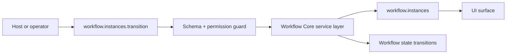
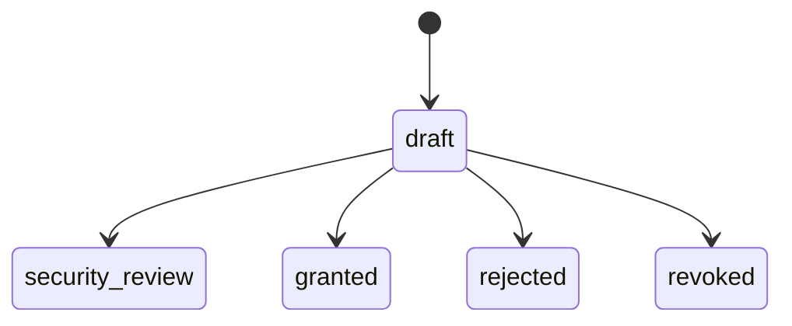

# Workflow Core Developer Guide

Explicit workflows and approval state machines.

**Maturity Tier:** `Hardened`

## Purpose And Architecture Role

Defines explicit workflow state machines and approval models so business processes stay inspectable instead of hiding in ad hoc hooks.

### This plugin is the right fit when

- You need **workflow definitions**, **approval states**, **transition rules** as a governed domain boundary.
- You want to integrate through declared actions, resources, jobs, workflows, and UI surfaces instead of implicit side effects.
- You need the host application to keep plugin boundaries honest through manifest capabilities, permissions, and verification lanes.

### This plugin is intentionally not

- Not a generic WordPress-style hook bus or plugin macro system.
- Not a product-specific UX suite beyond the exported admin or portal surfaces that ship today.

## Repo Map

| Path | Purpose |
| --- | --- |
| `package.json` | Root extracted-repo manifest, workspace wiring, and repo-level script entrypoints. |
| `framework/builtin-plugins/workflow-core` | Nested publishable plugin package. |
| `framework/builtin-plugins/workflow-core/src` | Runtime source, actions, resources, services, and UI exports. |
| `framework/builtin-plugins/workflow-core/tests` | Unit, contract, integration, and migration coverage where present. |
| `framework/builtin-plugins/workflow-core/docs` | Internal domain-doc source set kept in sync with this guide. |
| `framework/builtin-plugins/workflow-core/db/schema.ts` | Database schema contract when durable state is owned. |
| `framework/builtin-plugins/workflow-core/src/postgres.ts` | SQL migration and rollback helpers when exported. |

## Manifest Contract

| Field | Value |
| --- | --- |
| Package Name | `@plugins/workflow-core` |
| Manifest ID | `workflow-core` |
| Display Name | Workflow Core |
| Version | `0.1.0` |
| Kind | `app` |
| Trust Tier | `first-party` |
| Review Tier | `R1` |
| Isolation Profile | `same-process-trusted` |
| Framework Compatibility | ^0.1.0 |
| Runtime Compatibility | bun>=1.3.12 |
| Database Compatibility | postgres, sqlite |

## Dependency Graph And Capability Requests

| Field | Value |
| --- | --- |
| Depends On | `auth-core`, `org-tenant-core`, `role-policy-core`, `audit-core` |
| Requested Capabilities | `ui.register.admin`, `api.rest.mount`, `data.write.workflow` |
| Provides Capabilities | `workflow.instances` |
| Owns Data | `workflow.instances` |

### Dependency interpretation

- Direct plugin dependencies describe package-level coupling that must already be present in the host graph.
- Requested capabilities tell the host what platform services or sibling plugins this package expects to find.
- Provided capabilities and owned data tell integrators what this package is authoritative for.

## Public Integration Surfaces

| Type | ID / Symbol | Access / Mode | Notes |
| --- | --- | --- | --- |
| Action | `workflow.instances.transition` | Permission: `workflow.instances.transition` | Apply a governed transition to a workflow instance.<br>Purpose: Move workflows forward in a safe, auditable way while preserving approval and notification side effects.<br>Idempotent<br>Audited |
| Resource | `workflow.instances` | Portal disabled | Durable workflow instance record used to track approval and publication processes across the platform.<br>Purpose: Give operators and automation a single governed view of every active or historical workflow instance.<br>Admin auto-CRUD enabled<br>Fields: `approvalStatus`, `filter`, `label`, `description`, `businessMeaning`, `createdAt`, `sortable`, `label`, `description`, `businessMeaning`, `currentState`, `filter`, `label`, `description`, `businessMeaning`, `requiredForFlows`, `definitionKey`, `searchable`, `sortable`, `label`, `description`, `businessMeaning`, `dueAt`, `filter`, `sortable`, `label`, `description`, `businessMeaning`, `subjectType`, `filter`, `label`, `description`, `businessMeaning` |


### Workflow Catalog

| Workflow | Actors | States | Purpose |
| --- | --- | --- | --- |
| `access-review` | `requester`, `security-reviewer`, `admin` | `draft`, `security_review`, `granted`, `rejected`, `revoked` | Protect privileged access changes with explicit security approval and revocation paths. |
| `content-publication` | `author`, `editor`, `publisher` | `draft`, `editor_review`, `scheduled`, `published`, `rejected`, `archived` | Prevent content from reaching publication without editorial review and scheduled release control. |
| `invoice-approval` | `requester`, `approver`, `finance-admin` | `draft`, `pending_approval`, `approved`, `rejected`, `archived` | Ensure invoices are reviewed before final approval and archival. |


### UI Surface Summary

| Surface | Present | Notes |
| --- | --- | --- |
| UI Surface | Yes | A bounded UI surface export is present. |
| Admin Contributions | No | Only the baseline surface is exported. |
| Zone/Canvas Extension | No | No dedicated zone extension export. |

## Hooks, Events, And Orchestration

This plugin should be integrated through **explicit commands/actions, resources, jobs, workflows, and the surrounding Gutu event runtime**. It must **not** be documented as a generic WordPress-style hook system unless such a hook API is explicitly exported.

- No standalone plugin-owned lifecycle event feed is exported today.
- No plugin-owned job catalog is exported today.
- Workflow surface: `access-review`, `content-publication`, `invoice-approval`.
- Recommended composition pattern: invoke actions, read resources, then let the surrounding Gutu command/event/job runtime handle downstream automation.

## Storage, Schema, And Migration Notes

- Database compatibility: `postgres`, `sqlite`
- Schema file: `framework/builtin-plugins/workflow-core/db/schema.ts`
- SQL helper file: `framework/builtin-plugins/workflow-core/src/postgres.ts`
- Migration lane present: No

The plugin does not export a dedicated SQL helper module today. Treat the schema and resources as the durable contract instead of inventing undocumented SQL behavior.

## Failure Modes And Recovery

- Action inputs can fail schema validation or permission evaluation before any durable mutation happens.
- If downstream automation is needed, the host must add it explicitly instead of assuming this plugin emits jobs.
- There is no separate lifecycle-event feed to rely on today; do not build one implicitly from internal details.
- Schema-affecting changes need extra care because there is no dedicated migration lane yet.

## Mermaid Flows

### Primary Lifecycle



### Workflow State Machine




## Integration Recipes

### 1. Host wiring

```ts
import { manifest, transitionWorkflowInstanceAction, WorkflowInstanceResource, workflowDefinitions, uiSurface } from "@plugins/workflow-core";

export const pluginSurface = {
  manifest,
  transitionWorkflowInstanceAction,
  WorkflowInstanceResource,
  
  workflowDefinitions,
  
  uiSurface
};
```

Use this pattern when your host needs to register the plugin’s declared exports without reaching into internal file paths.

### 2. Action-first orchestration

```ts
import { manifest, transitionWorkflowInstanceAction } from "@plugins/workflow-core";

console.log("plugin", manifest.id);
console.log("action", transitionWorkflowInstanceAction.id);
```

- Prefer action IDs as the stable integration boundary.
- Respect the declared permission, idempotency, and audit metadata instead of bypassing the service layer.
- Treat resource IDs as the read-model boundary for downstream consumers.

### 3. Cross-plugin composition

- Register the workflow definitions with the host runtime instead of re-encoding state transitions outside the plugin.
- Drive follow-up automation from explicit workflow transitions and resource reads.
- Pair workflow decisions with notifications or jobs in the outer orchestration layer when humans must be kept in the loop.

## Test Matrix

| Lane | Present | Evidence |
| --- | --- | --- |
| Build | Yes | `bun run build` |
| Typecheck | Yes | `bun run typecheck` |
| Lint | Yes | `bun run lint` |
| Test | Yes | `bun run test` |
| Unit | Yes | 1 file(s) |
| Contracts | Yes | 1 file(s) |
| Integration | No | No integration files found |
| Migrations | No | No migration files found |

### Verification commands

- `bun run build`
- `bun run typecheck`
- `bun run lint`
- `bun run test`
- `bun run test:contracts`
- `bun run test:unit`
- `bun run docs:check`

## Current Truth And Recommended Next

### Current truth

- Exports 1 governed action: `workflow.instances.transition`.
- Owns 1 resource contract: `workflow.instances`.
- Publishes 3 workflow definitions with state-machine descriptions and mandatory steps.
- Registers a bounded UI surface that can be hosted by the surrounding admin or portal shell.
- Defines a durable data schema contract even though no explicit SQL helper module is exported.

### Current gaps

- No dedicated integration test lane is exported in this repo today; validation currently leans on build, lint, typecheck, and test lanes.
- The plugin owns durable data state, but it does not yet ship a dedicated migration verification lane in this repo.
- The plugin exposes a UI surface, but not a richer admin workspace contribution module.

### Recommended next

- Add richer execution-state and replay guidance if more plugins adopt workflow-driven orchestration.
- Expose tighter integration patterns with jobs and notifications when human approvals start driving more automation.
- Add stronger operator-facing reconciliation and observability surfaces where runtime state matters.
- Promote any currently implicit cross-plugin lifecycles into explicit command, event, or job contracts when those integrations stabilize.
- Add targeted integration coverage once the current lifecycle path is stable enough to benefit from end-to-end assertions.
- Add explicit migration or rollback coverage if this domain becomes more operationally sensitive.
- Broaden the admin entry surface only if operators need more than the current embedded view or resource listing.

### Later / optional

- Visual editors or migration helpers for workflow definitions once the current state-machine contract hardens.
- Dedicated federation or external identity/provider adapters once the core contracts are stable.
